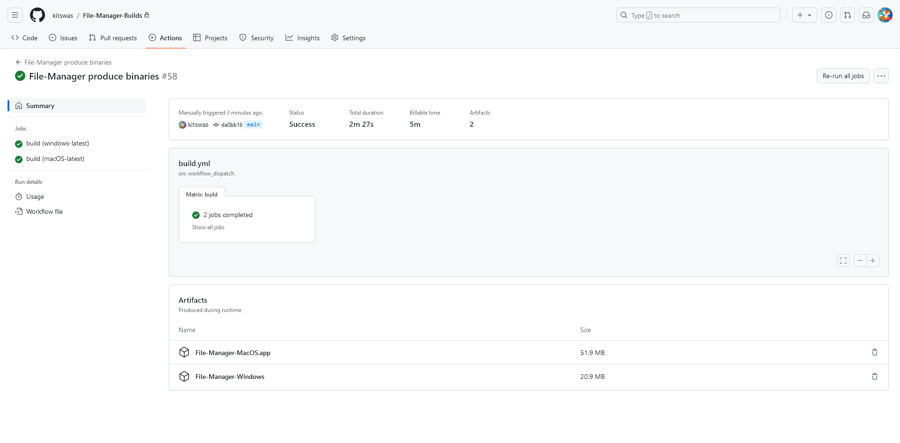

# File Manager Builder

This repository contains a GitHub Action that fetches the sourcecode for [File Manager](https://github.com/kitswas/File-Manager) and builds it, producing binaries for Windows and macOS.

## Usage

[Fork this repository](https://github.com/kitswas/File-Manager-Builds/fork).  
Head on to the Actions tab and run the workflow.

The first run will take a while, subsequent runs will be faster.

The generated binaries will be available as artifacts.
